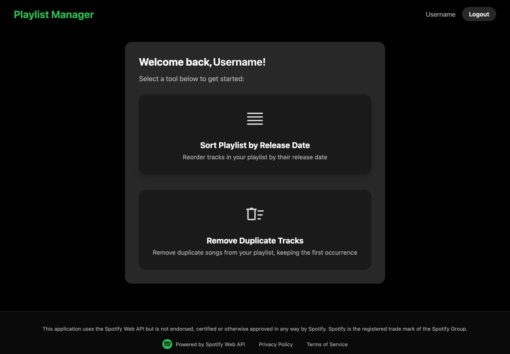
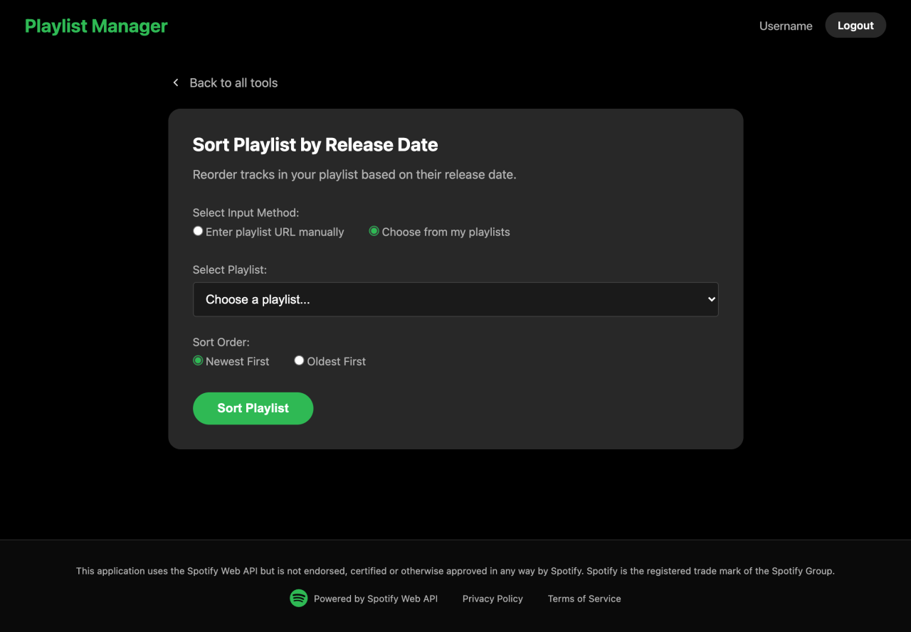
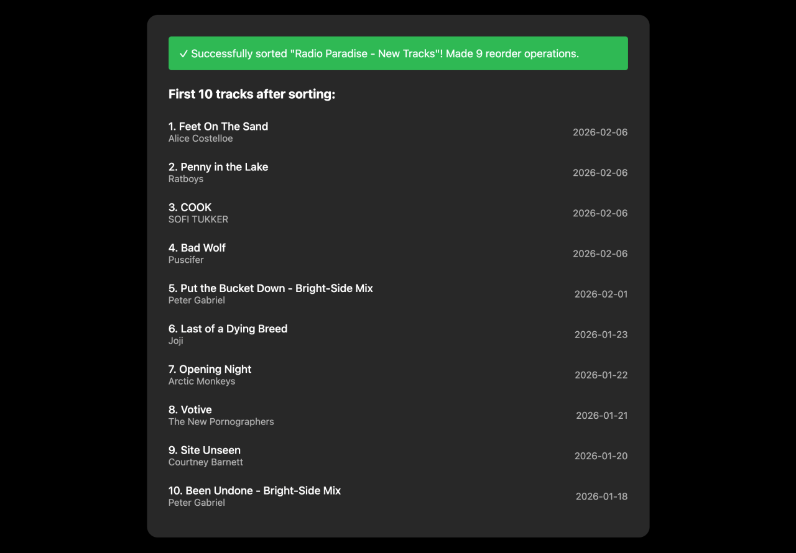
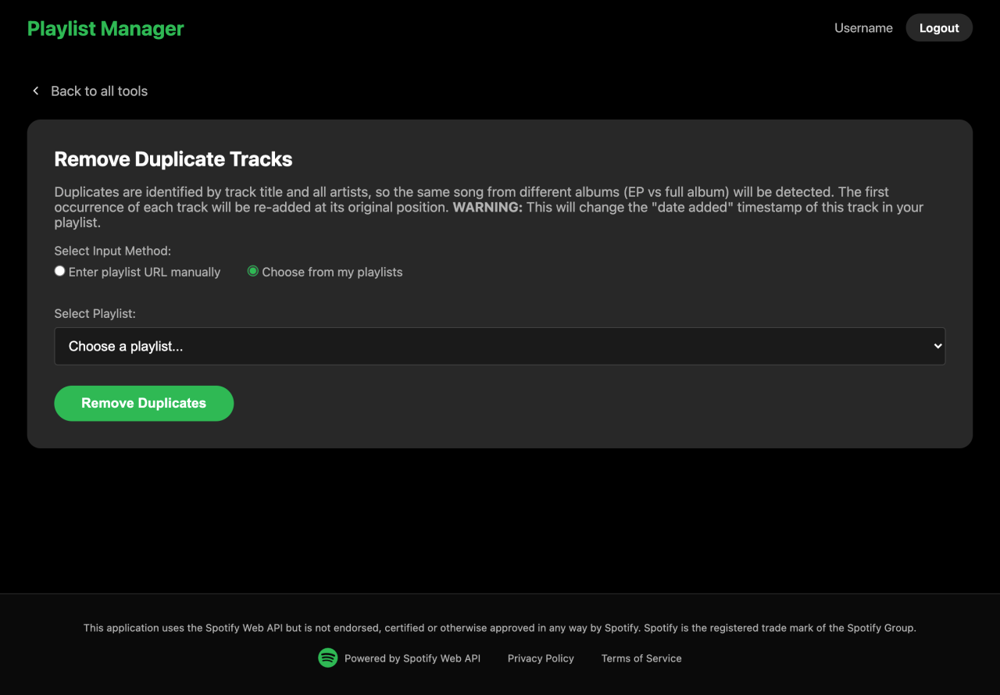
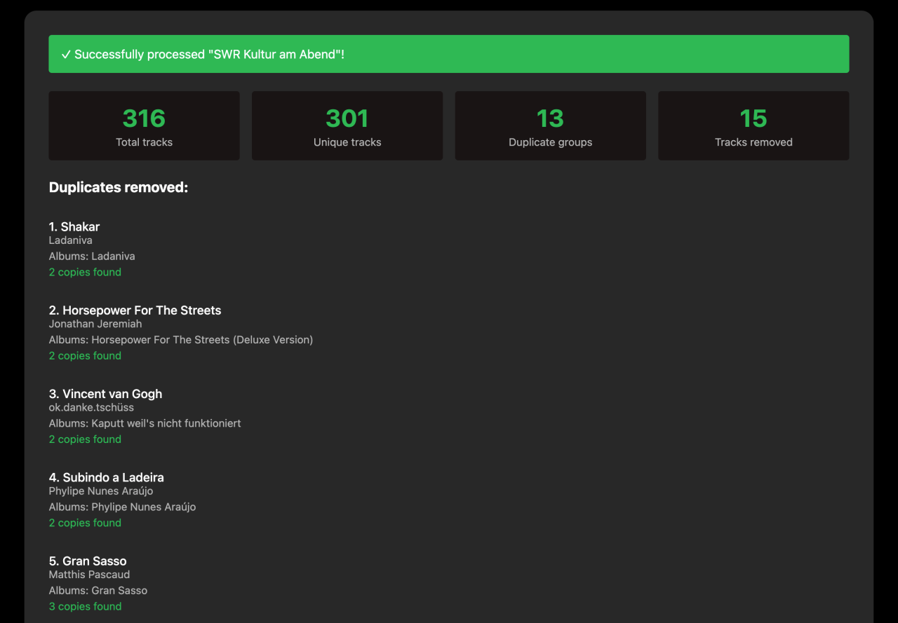

# Spotify Playlist Manager

A modern web application for managing and organizing Spotify playlists with powerful sorting and duplicate removal capabilities.

## Features

### Core Functionality

- **Sort by Release Date** - Organize playlists with newest or oldest tracks first
- **Remove Duplicates** - Intelligently detect and remove duplicate tracks
- **Modern Web Interface** - Clean, responsive design with real-time feedback
- **Secure Authentication** - OAuth 2.0 flow with Spotify

### Advanced Capabilities
- **Smart Duplicate Detection** - Identifies same songs across different albums (EP vs full album releases)
- **Batch Operations** - Efficiently handle playlists with hundreds of tracks
- **Graceful Error Handling** - User-friendly messages for all error scenarios
- **Production-Ready Infrastructure** - Rate limiting, session management, and Redis support

## Screenshots

<table>
  <tr>
    <td align="center"><strong>Main Menu</strong><br></td>
    <td align="center"><strong>Sort Playlist</strong><br></td>
    <td align="center"><strong>Sort Result</strong><br></td>
  </tr>
  <tr>
    <td align="center"><strong>Remove Duplicates</strong><br></td>
    <td align="center"><strong>Removal Result</strong><br></td>
    <td></td>
  </tr>
</table>

## Quick Start

### Prerequisites
- Python 3.12+
- Spotify account
- Spotify Developer App ([create one here](https://developer.spotify.com/dashboard))

### Installation

1. **Clone the repository**
   ```bash
   git clone <repository-url>
   cd playlist-manager
   ```

2. **Install dependencies**
   ```bash
   # Using uv (recommended)
   uv sync
   
   # Or using pip
   pip install -e .
   ```

3. **Set up Spotify App**
   - Visit [Spotify Developer Dashboard](https://developer.spotify.com/dashboard)
   - Create a new app
   - Add redirect URI: `http://localhost:5000/callback`
   - Note your Client ID and Client Secret

4. **Configure environment**
   ```bash
   cp .env.example .env
   # Edit .env with your Spotify credentials
   ```

5. **Run the application**
   ```bash
   uv run python web_app.py
   ```

6. **Open in browser**
   ```
   http://localhost:5000
   ```

## Using the Web Application

### Home Page
- Login with Spotify to access your playlists
- View privacy policy and terms of service
- Simple, intuitive navigation

### Sort Playlist
1. Select a playlist from dropdown or paste a Spotify URL
2. Choose sort order:
   - **Newest First** - Latest releases at the top
   - **Oldest First** - Classic tracks at the top
3. Click "Sort Playlist"
4. View results including:
   - Number of tracks sorted
   - Preview of first 10 tracks
   - Release date for each track

### Remove Duplicates
1. Select a playlist to clean
2. Click "Remove Duplicates"
3. Review the results:
   - Total duplicates found and removed
   - Details of duplicate groups
   - Final playlist size

### Supported Input Formats
- **Spotify URLs**: `https://open.spotify.com/playlist/37i9dQZF1DXcBWIGoYBM5M`
- **Playlist Selection**: Choose from dropdown menu
- **Playlist IDs**: Direct ID like `37i9dQZF1DXcBWIGoYBM5M`

## Architecture

### Key Components

| File | Purpose |
|------|---------|
| `web_app.py` | Flask application and route handlers |
| `spotify_auth.py` | OAuth authentication and token management |
| `sort_playlist_by_release_date.py` | Playlist sorting algorithm |
| `remove_duplicates_from_playlist.py` | Duplicate detection and removal |
| `rate_limiter.py` | API rate limiting with exponential backoff |
| `redis_oauth_store.py` | OAuth state storage (Redis/in-memory) |
| `secure_token_storage.py` | Encrypted token storage |
| `error_handler.py` | User-friendly error messages |

### Security Features
- **Encrypted Token Storage** - Fernet encryption for OAuth tokens
- **CSRF Protection** - State parameter validation
- **Secure Sessions** - HTTPOnly, Secure, SameSite cookies
- **HTTPS Enforcement** - Automatic redirect in production

### Performance Optimizations
- **Rate Limiting** - Respects Spotify's ~180 requests/minute limit
- **Request Throttling** - Maintains ~3 requests/second
- **Efficient Algorithms** - Batch operations minimize API calls
- **Session Management** - Redis-backed sessions for scalability

## Production Deployment

See **[DEPLOYMENT.md](DEPLOYMENT.md)** for complete deployment instructions.

### Quick Deployment (Render)

1. **Generate secret key**:
   ```bash
   python scripts/generate-secret-key.py
   ```

2. **Validate configuration**:
   ```bash
   python scripts/check-production-config.py
   ```

3. **Deploy to Render**:
   - Push to GitHub
   - Create Render services (Web + Redis)
   - Set environment variables
   - Deploy!

### Key Files
- `DEPLOYMENT.md` - Complete deployment guide
- `render.yaml` - Render deployment configuration
- `scripts/generate-secret-key.py` - Secret key generator
- `scripts/check-production-config.py` - Configuration validator

### Supported Platforms
- **Render** - Full configuration included (recommended)
- **Heroku** - Redis addon supported
- **AWS/GCP/Azure** - Use managed Redis services
- **Docker** - Containerization ready
- **Self-hosted** - With nginx/Redis

## API Compliance

This application follows Spotify's Developer Terms of Service:
- Proper rate limiting implementation
- Required Spotify branding and attribution
- No music content downloading or caching
- Privacy policy and terms of service included
- User consent for data operations
- Descriptive User-Agent headers

### OAuth Scopes Used
- `playlist-modify-public` - Modify user's public playlists
- `playlist-modify-private` - Modify user's private playlists
- `playlist-read-private` - Access user's private playlists
- `user-read-email` - Read user's email for identification

## Troubleshooting

### Common Issues

**"Playlist not found"**
- Ensure you're logged in with the account that owns the playlist
- Check if the playlist is set to private

**Rate limit errors**
- The app automatically retries with exponential backoff
- For persistent errors, wait a few minutes

**Login issues**
- Verify redirect URI matches in both `.env` and Spotify app settings
- Clear browser cookies and try again

**Redis connection failed**
- App automatically falls back to in-memory storage
- Check Redis URL format and credentials

## Contributing

Contributions are welcome! Please:
1. Fork the repository
2. Create a feature branch
3. Follow the existing code style
4. Add tests for new functionality
5. Submit a pull request

## License

This project is licensed under the MIT License - see the [LICENSE](LICENSE) file for details.

### Legal Notice

This software is not affiliated with, endorsed by, or sponsored by Spotify AB. Spotify is a registered trademark of Spotify AB.

Use of the Spotify Web API requires compliance with [Spotify's Developer Terms of Service](https://developer.spotify.com/terms). Users must:
- Obtain their own Spotify API credentials
- Comply with Spotify's branding guidelines
- Respect Spotify's rate limits and usage policies
- Not use this software for any purpose that violates Spotify's terms

## Acknowledgments

Built with:
- [Spotipy](https://github.com/spotipy-dev/spotipy) - Spotify Web API wrapper
- [Flask](https://flask.palletsprojects.com/) - Web framework
- [Redis](https://redis.io/) - Session storage
- Love for music organization